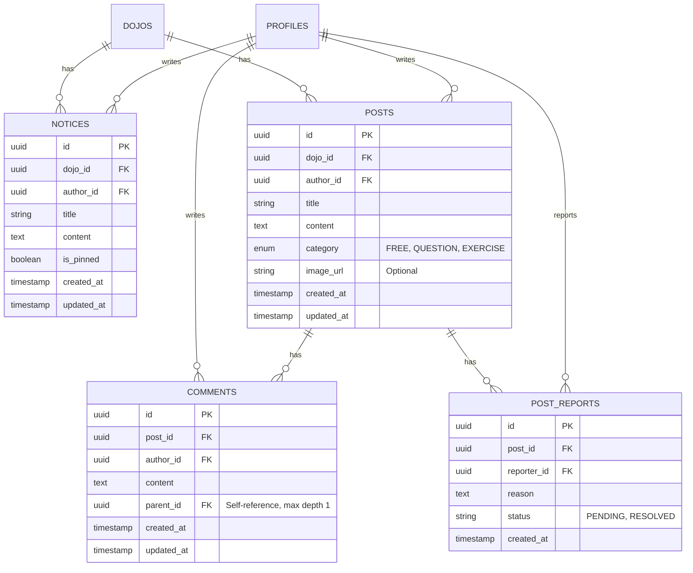

# Data Model: Community Features

## ER Diagram

## Tables Definition

### 1. `notices`
Admin-created announcements.
- **RLS**:
  - `SELECT`: `auth.uid() IN (SELECT user_id FROM profiles WHERE dojo_id = notices.dojo_id)`
  - `INSERT/UPDATE/DELETE`: `auth.uid() IN (SELECT user_id FROM profiles WHERE dojo_id = notices.dojo_id AND role IN ('owner', 'instructor'))`

### 2. `posts`
User-created community content.
- **RLS**:
  - `SELECT`: `auth.uid() IN (SELECT user_id FROM profiles WHERE dojo_id = posts.dojo_id)`
  - `INSERT`: `auth.uid() IN (SELECT user_id FROM profiles WHERE dojo_id = posts.dojo_id)`
  - `UPDATE/DELETE`: `author_id = auth.uid()` OR `auth.uid() IN (Admins...)`

### 3. `comments`
- **RLS**:
  - `SELECT`: Same as posts.
  - `INSERT`: Same as posts.
  - `UPDATE/DELETE`: `author_id = auth.uid()` OR `auth.uid() IN (Admins...)`

### 4. `post_reports`
- **RLS**:
  - `INSERT`: Authenticated users.
  - `SELECT/UPDATE`: Admins only.

## Storage
Bucket: `community-images`
- Path: `{dojo_id}/{post_id}/{filename}`
- Policy:
  - Read: Public (or check dojo membership)
  - Write: Authenticated users.
