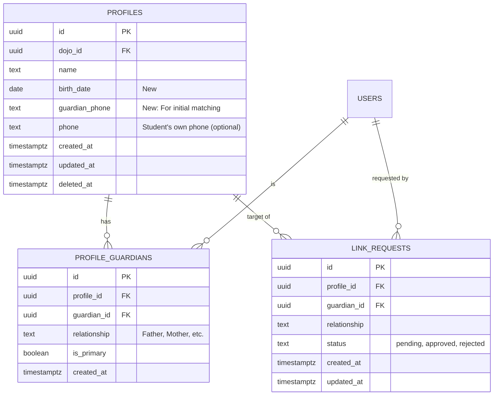

# Data Model: Member Link System

## Entity Relationship Diagram (ERD)

## Table Definitions

### `profiles` (Update)
Existing table.
*   **Remove/Deprecate**: `is_shadow` (Logic should no longer rely on this).
*   **Add**:
    *   `birth_date` (DATE, NULLABLE): For identity verification.
    *   `guardian_phone` (TEXT, NULLABLE): Normalized phone number (e.g., `01012345678`) for auto-discovery.

### `profile_guardians` (New)
Bridge table for N:M relationship between Profiles (Students) and Users (Guardians).
*   `id` (UUID, PK, Default: `gen_random_uuid()`)
*   `profile_id` (UUID, NOT NULL, FK `profiles.id`)
*   `guardian_id` (UUID, NOT NULL, FK `auth.users.id`)
*   `relationship` (TEXT, NOT NULL): e.g., '부', '모', '조부모', '기타'.
*   `created_at` (TIMESTAMPTZ, Default: `now()`)
*   **Constraints**: Unique `(profile_id, guardian_id)`.

### `link_requests` (New)
For manual linking when auto-discovery fails.
*   `id` (UUID, PK, Default: `gen_random_uuid()`)
*   `profile_id` (UUID, NOT NULL, FK `profiles.id`)
*   `guardian_id` (UUID, NOT NULL, FK `auth.users.id`)
*   `relationship` (TEXT, NOT NULL)
*   `status` (TEXT, Default: 'pending'): Check `IN ('pending', 'approved', 'rejected')`.
*   `created_at` (TIMESTAMPTZ, Default: `now()`)
*   `updated_at` (TIMESTAMPTZ, Default: `now()`)

## RLS Policies

### `profiles`
*   **View**:
    *   Admins (Owner/Instructor of Dojo) can view all profiles in their dojo.
    *   Guardians can view profiles if `id` exists in `profile_guardians` where `guardian_id = auth.uid()`.
*   **Update**: Admin only.

### `profile_guardians`
*   **View**: User is the guardian OR User is Admin of the profile's dojo.
*   **Insert**: Admin OR System (via Secure RPC/Action). (Direct insert by user restricted).
*   **Delete**: Admin or Guardian (unlink self).

### `link_requests`
*   **View**: Requestor (Guardian) OR Admin of target profile.
*   **Insert**: Authenticated User (Guardian).
*   **Update**: Admin (Approve/Reject).
